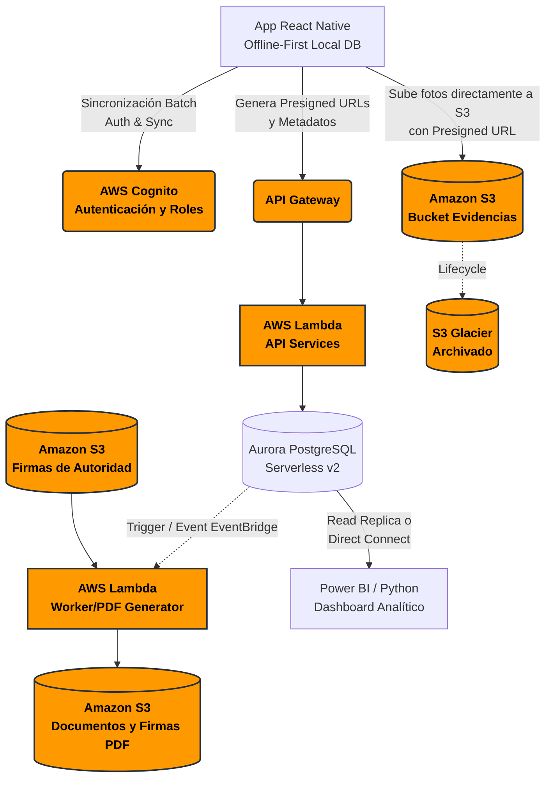
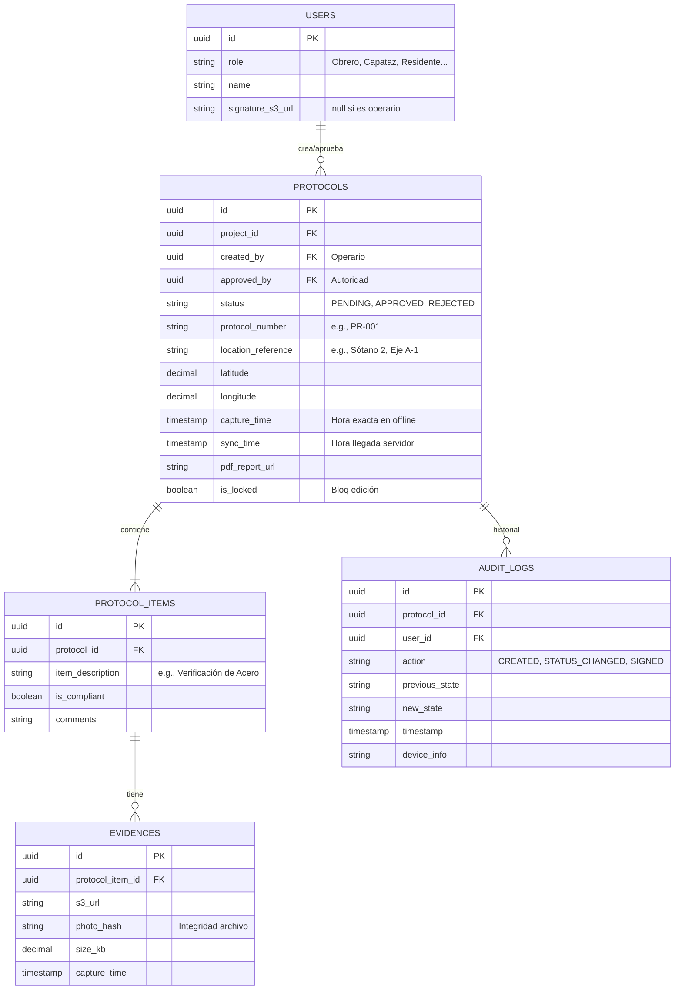

# Arquitectura de Software QA/QC MVP "S-CUA" (Proyecto QAQC_Automatizado)

Basado en tu propuesta estructurada, he diseñado la arquitectura óptima, segura y escalable para el MVP "S-CUA", priorizando el enfoque **Offline-First**, el **Bajo Costo (Pay-as-you-go)** y la **Integración con Analytics**.

---

## 1. Diagrama de Arquitectura Lógica en AWS

El flujo está diseñado sobre componentes Serverless para anular la gestión de servidores y minimizar costos operativos.

### Explicación del Flujo:
1. **Captura Offline:** El Capataz o Inspector toma la foto. La App local (SQLite/WatermelonDB) guarda el registro y la foto en cola.
2. **Sincronización:** Al detectar señal, la App pide a AWS API Gateway/Lambda unas *Presigned URLs* de Amazon S3.
3. **Subida Directa:** La App sube las fotos *directamente* a S3 usando las Presigned URLs (evitando saturar el ancho de banda del Backend). Luego, envía el JSON con los metadatos y relaciones a Lambda para guardarlo en la Base de Datos.
4. **Firmado y PDF:** Cuando un usuario de Autoridad (Residente/Jefe) "Aprueba" un protocolo, se dispara un Worker en Lambda. Este proceso asíncrono toma la estructura de la base de datos, obtiene la imagen de la firma de S3, estampa todo en un PDF con Timestamp y lo guarda en S3 protegidos.

---

## 2. Decisión de Base de Datos: PostgreSQL (Amazon Aurora Serverless v2)

Para este caso de uso, se recomienda firmemente **PostgreSQL** por encima de DynamoDB.
*   **¿Por qué no DynamoDB?** DynamoDB es excelente para lecturas rápidas K-V, pero es complejo para modelos de datos altamente vinculados como este (Proyectos -> Protocolos -> Ítems -> Evidencias -> Roles -> Audit Logs). Además, la demanda de Power BI requiere SQL estructurado o cargas ETL pesadas en DynamoDB.
*   **¿Por qué Aurora PostgreSQL Serverless?** Escala a 0 (costo bajísimo al inicio) y soporta cargas variables. Las 135,000 filas por proyecto + evidencias no son un volumen grande para PostgreSQL; un motor relacional puede manejar millones de filas cómodamente con los índices adecuados. Además, permite a Power BI conectarse de forma nativa (DirectQuery).

### Esquema de Base de Datos Propuesto

---

## 3. Estrategia de Sincronización y Captura Rápida en Celular (Offline-First)

Para garantizar la **ingesta rapidísima de fotos en campo** (menos de 3 clics) y soportar 40,000 fotos sin colapsar la red:

1.  **Tecnología Nativa Optimizada (Frontend con React Native):** A nivel de desarrollo, se utilizará **React Native** (en lugar de Flutter). La decisión se basa en tres factores clave para este MVP:
    *   **Ecosistema Offline-First:** React Native tiene integración nativa y madura con **WatermelonDB**, la mejor base de datos reactiva para sincronización offline pesada. (Flutter requeriría soluciones menos integradas para este flujo específico de sincronización delegada).
    *   **Control de Hardware:** Librerías como `react-native-vision-camera` permiten acceso de bajo nivel (C/C++) a la cámara del celular, logrando aperturas en milisegundos.
    *   **Agilidad MVP:** Permite compartir lógica de validaciones (JavaScript/TypeScript) entre el móvil y las funciones Lambda del backend de AWS.
2.  **BD Local Reactiva (WatermelonDB):** El celular guarda instantáneamente la foto y el registro de inspección en una base de datos local SQLite ultrarrápida (WatermelonDB). El Capataz no espera ningún "cargando..."; toma la foto y sigue trabajando.
3.  **Compresión en Origen (Fondo):** Inmediatamente después del disparo, un proceso en segundo plano (Background Worker) comprime la imagen (reduciéndola de 4MB a ~400KB), sin bloquear la interfaz del usuario.
4.  **Patrón S3 Presigned URLs + Subida en Background:**
    *   Al detectar conexión 4G o WiFi, el celular solicita silenciosamente URLs pre-firmadas al backend.
    *   La App sube las fotos *directamente* desde el celular a Amazon S3 en segundo plano (evitando saturar nuestro backend).
    *   Si el obrero entra a un sótano y pierde señal, la subida se pausa automáticamente y se reanuda al salir (gracias a Background Fetch / WorkManager en iOS/Android).
5.  **Amazon S3 Lifecycle Policies:** Las fotos antiguas (>90 días) pasan automáticamente a almacenamiento barato (Glacier).

---

## 4. Módulo de Validaciones, Firmas y Flujo de Aprobación

1.  **Segregación de Funciones Middleware:** A través de **AWS Cognito Attributes** y Middlewares en el backend y el frontend. Un Capataz nunca verá el botón "Aprobar", ni la API lo permitirá si intenta hacer la llamada manual.
2.  **Inmutabilidad de Registro (Bloqueo):** Al ejecutarse una acción donde el `role == "Supervisor|Residente"` actualiza el estado a `APPROVED`, un Trigger en PostgreSQL (o la lógica del DAO) establece `is_locked = TRUE`. A partir de ahí, toda modificación HTTP PUT al registro se rechaza (Code HTTP 403 Forbidden).
3.  **Firmado y Estampado Automático:**
    *   Un usuario de autoridad configura su firma subiéndola a un bucket exclusivo (`s3://scua-firmas-autoridades`).
    *   Tras la aprobación, un **AWS SQS -> Lambda** inicia un proceso en segundo plano (Worker) usando `Puppeteer` o `PDFKit`.
    *   Se extrae la info del protocolo, las fotos de S3, y la firma del usuario.
    *   Se compone el documento PDF incrustando el sello, la fecha servida (Timestamp inmutable del backend, no del móvil), y se genera un hash SHA-256 del PDF guardado en la BD y en los Metadatos de S3 (para validez legal ante peritajes constructivos).
4.  **Audit Log:** Cualquier acción en los endpoints `/protocols/{id}` genera un insert asíncrono en la tabla `AUDIT_LOGS`, garantizando que la trazabilidad sea silenciosa y exacta.

---

## 5. Plan de Integración con Analytics (Power BI / Python)

*   **Paso 1: Conexión Directa controlada (MVP inicial).** Dado que PostgreSQL en Aurora Serverless permite crear conexiones con usuarios de Sólo Lectura (Read-only roles). Power BI puede usar DirectQuery hacia AWS conectando por IP whitelisting o VPN/Bation Host.
*   **Paso 2: Arquitectura Data Warehouse Serverless (A futuro).** A medida que aumentan los proyectos: AWS Lake Formation o AWS Glue extraen la data operativa de PostgreSQL todos los días a medianoche (ETL) pasándola a un S3 Data Lake como archivos `.parquet`, que luego pueden ser consultados masiva y costosamente de forma optimizada por **Amazon Athena** directo desde Power BI. Esto quita la carga analítica de la base de datos transaccional.
